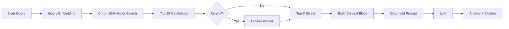

# Architecture — RAG Pipeline (Day 08 Lab)

> Template: Điền vào các mục này khi hoàn thành từng sprint.
> Deliverable của Documentation Owner.

## 1. Tổng quan kiến trúc

```
[Raw Docs]
    ↓
[index.py: Preprocess → Chunk → Embed → Store]
    ↓
[ChromaDB Vector Store]
    ↓
[rag_answer.py: Query → Retrieve → Rerank → Generate]
    ↓
[Grounded Answer + Citation]
```

**Mô tả ngắn gọn:**
> Nhóm xây dựng một hệ thống RAG làm trợ lý tri thức nội bộ cho khối CS và IT Helpdesk.  
> Hệ thống index các tài liệu chính sách, SLA, SOP và FAQ vào ChromaDB, sau đó retrieve ngữ cảnh liên quan để LLM sinh câu trả lời có căn cứ và citation nguồn.  
> Mục tiêu là giúp nhân sự tra cứu nhanh, giảm trả lời sai theo trí nhớ và chuẩn hóa phản hồi theo tài liệu chính thức.

---

## 2. Indexing Pipeline (Sprint 1)

### Tài liệu được index
| File | Nguồn | Department | Số chunk |
|------|-------|-----------|---------|
| `policy_refund_v4.txt` | policy/refund-v4.pdf | CS | 6 |
| `sla_p1_2026.txt` | support/sla-p1-2026.pdf | IT | 11 |
| `access_control_sop.txt` | it/access-control-sop.md | IT Security | 7 |
| `it_helpdesk_faq.txt` | support/helpdesk-faq.md | IT | (included in IT total) |
| `hr_leave_policy.txt` | hr/leave-policy-2026.pdf | HR | 5 |

### Quyết định chunking
| Tham số | Giá trị | Lý do |
|---------|---------|-------|
| Chunk size | 450 tokens (~1800 chars) | Sweet spot giữa context đủ và precision cao |
| Overlap | 75 tokens (~300 chars) | Đảm bảo không mất thông tin ở ranh giới chunk |
| Chunking strategy | Heading-based + paragraph-based | Cắt theo section heading trước, sau đó chia nhỏ theo paragraph nếu quá dài |
| Metadata fields | source, section, effective_date, department, access | Phục vụ filter, freshness, citation |

### Embedding model
- **Model**: OpenAI text-embedding-3-small
- **Vector store**: ChromaDB (PersistentClient)
- **Similarity metric**: Cosine
- **Total chunks indexed**: 29 chunks

---

## 3. Retrieval Pipeline (Sprint 2 + 3)

### Baseline (Sprint 2)
| Tham số | Giá trị |
|---------|---------|
| Strategy | Dense (embedding similarity) |
| Top-k search | 10 |
| Top-k select | 3 |
| Rerank | Không |

### Variant (Sprint 3)
| Tham số | Giá trị | Thay đổi so với baseline |
|---------|---------|------------------------|
| Strategy | Hybrid (Dense + BM25 RRF) | Kết hợp embedding similarity và keyword matching |
| Top-k search | 10 | Giữ nguyên |
| Top-k select | 3 | Giữ nguyên |
| Rerank | Không | Giữ nguyên (chỉ đổi 1 biến: retrieval mode) |
| Query transform | Không | Không áp dụng |
| Dense/Sparse weight | 0.6 / 0.4 | Cấu hình mặc định hybrid ở Sprint 3 |

### Variant 2 (Sprint 4 tuning)
| Tham số | Giá trị | Thay đổi so với Variant 1 |
|---------|---------|---------------------------|
| Strategy | Hybrid (Dense + BM25 RRF) | Giữ nguyên |
| Top-k search | 10 | Giữ nguyên |
| Top-k select | 3 | Giữ nguyên |
| Rerank | Không | Giữ nguyên |
| Dense/Sparse weight | 0.8 / 0.2 | Tăng trọng số dense, giảm sparse |

### Variant 3 (Sprint 4 tuning)
| Tham số | Giá trị | Thay đổi so với baseline |
|---------|---------|--------------------------|
| Strategy | Hybrid (Dense + BM25 RRF) | Đổi retrieval mode |
| Top-k search | 15 | Tăng từ 10 lên 15 |
| Top-k select | 5 | Tăng từ 3 lên 5 |
| Rerank | Không | Giữ nguyên |
| Dense/Sparse weight | 0.6 / 0.4 | Giữ như hybrid mặc định |
| Prompt | Grounded prompt v2 (multi-requirement format) | Ép trả lời đủ ý, có bullet theo từng yêu cầu |

### Kết quả tuning trọng số (0.8/0.2)
| Metric | Baseline Sprint 2 | Variant 1 (0.6/0.4) | Variant 2 (0.8/0.2) |
|--------|-------------------|----------------------|----------------------|
| Faithfulness | 4.70 | 4.10 | 5.00 |
| Relevance | 4.80 | 4.20 | 4.80 |
| Context Recall | 5.00 | 5.00 | 5.00 |
| Completeness | 3.70 | 3.20 | 3.40 |

**Kết luận sau Sprint 4:**
> Điều chỉnh trọng số về `0.8/0.2` giúp phục hồi chất lượng so với Variant 1 (đặc biệt faithfulness +0.90 và relevance +0.60),
> nhưng vẫn chưa vượt baseline dense về completeness (-0.30).
> Vì vậy kiến trúc production tạm thời vẫn ưu tiên baseline dense; variant 2 phù hợp khi muốn ưu tiên giảm hallucination.

### Kết quả Variant 3 (top-k 15/5 + prompt v2)
| Metric | Baseline (10/3, dense) | Variant 3 (15/5, hybrid 0.6/0.4) | Delta |
|--------|--------------------------|-----------------------------------|-------|
| Faithfulness | 4.50 | 4.80 | +0.30 |
| Relevance | 4.60 | 4.60 | +0.00 |
| Context Recall | 5.00 | 5.00 | +0.00 |
| Completeness | 3.80 | 3.60 | -0.20 |

**Kết luận Variant 3:**
> Variant 3 cải thiện faithfulness và giữ nguyên relevance/recall, nhưng completeness vẫn thấp hơn baseline.
> Kiến trúc hiện tại phù hợp nếu ưu tiên tính đúng (groundedness), còn nếu ưu tiên trả lời đủ ý thì baseline dense vẫn ổn định hơn.

**Lý do chọn variant này:**
> Chọn hybrid (dense + BM25 với Reciprocal Rank Fusion) vì corpus có cả câu tự nhiên (policy, quy trình) lẫn keyword/mã lỗi chuyên ngành (P1, Level 3, VPN, Flash Sale).
> Dense retrieval tốt cho câu hỏi paraphrase ("hoàn tiền" ↔ "refund"), còn BM25 tốt cho exact match (tên riêng, mã lỗi).
> RRF kết hợp cả hai ranking mà không cần normalize score.

---

## 4. Generation (Sprint 2)

### Grounded Prompt Template
```
Answer only from the retrieved context below.
If the context is insufficient, say you do not know.
Cite the source field when possible.
Keep your answer short, clear, and factual.

Question: {query}

Context:
[1] {source} | {section} | score={score}
{chunk_text}

[2] ...

Answer:
```

### LLM Configuration
| Tham số | Giá trị |
|---------|---------|
| Model | gpt-4o-mini |
| Temperature | 0 (để output ổn định cho eval) |
| Max tokens | 512 |

---

## 5. Failure Mode Checklist

> Dùng khi debug — kiểm tra lần lượt: index → retrieval → generation

| Failure Mode | Triệu chứng | Cách kiểm tra |
|-------------|-------------|---------------|
| Index lỗi | Retrieve về docs cũ / sai version | `inspect_metadata_coverage()` trong index.py |
| Chunking tệ | Chunk cắt giữa điều khoản | `list_chunks()` và đọc text preview |
| Retrieval lỗi | Không tìm được expected source | `score_context_recall()` trong eval.py |
| Generation lỗi | Answer không grounded / bịa | `score_faithfulness()` trong eval.py |
| Token overload | Context quá dài → lost in the middle | Kiểm tra độ dài context_block |

---

## 6. Diagram (tùy chọn)

> TODO: Vẽ sơ đồ pipeline nếu có thời gian. Có thể dùng Mermaid hoặc drawio.


